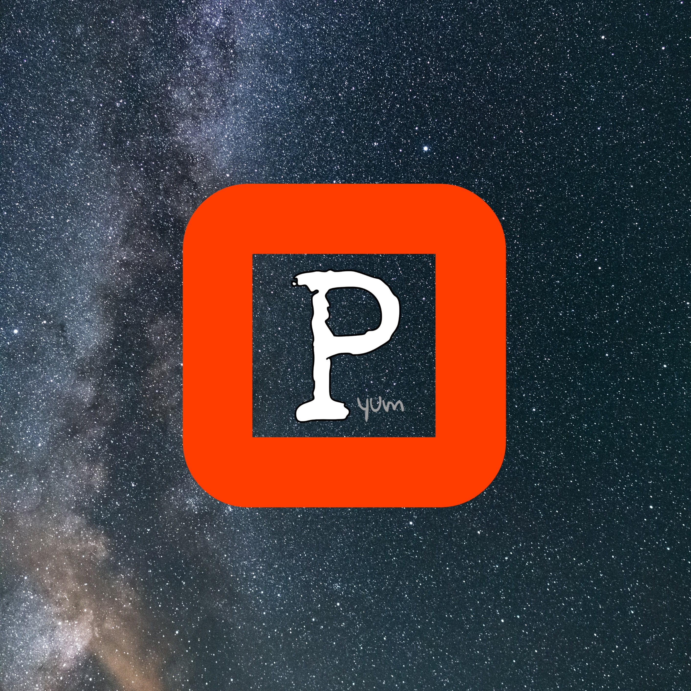

<!--
**opeeyum/opeeyum** is a ✨ _special_ ✨ repository because its `README.md` (this file) appears on your GitHub profile.

Here are some ideas to get you started:

- 🔭 I’m currently working on ...
- 🌱 I’m currently learning ...
- 👯 I’m looking to collaborate on ...
- 🤔 I’m looking for help with ...
- 💬 Ask me about ...
- 📫 How to reach me: ...
- 😄 Pronouns: ...
- ⚡ Fun fact: ...
-->
<h1 align="center">Hi there 👋, I'm Omprakash 😉 </h1>
<h3 align="center">A Computer Science Engineer.</h3>

 
  

<!-- 🌱 I'm Currently learning **Django and Django Rest Framework**-->

- 👨‍💻 All of my projects are available under [Repository Section](https://github.com/opeeyum?tab=repositories)

<!-- 💬 Majorly worked with **Python**-->

<!-- 📫 How to reach me **omprakash36mishra@gmail.com**-->

<h3 align="center">Languages and Tools:</h3>

 
  
   
   
   
   
    

    
    

